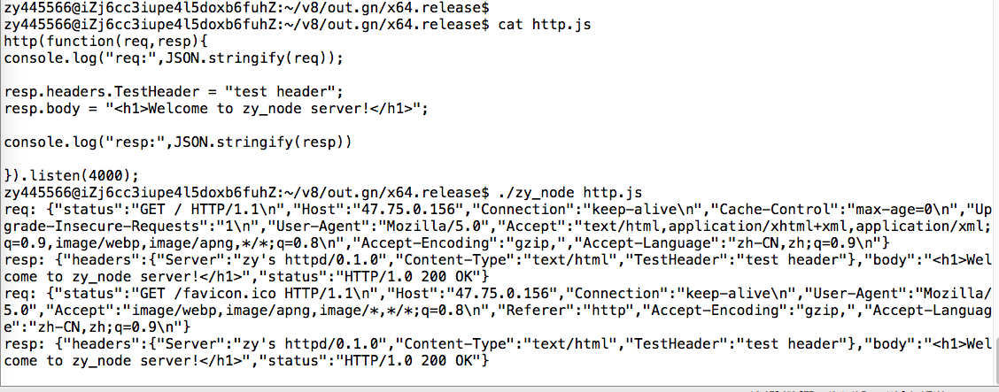
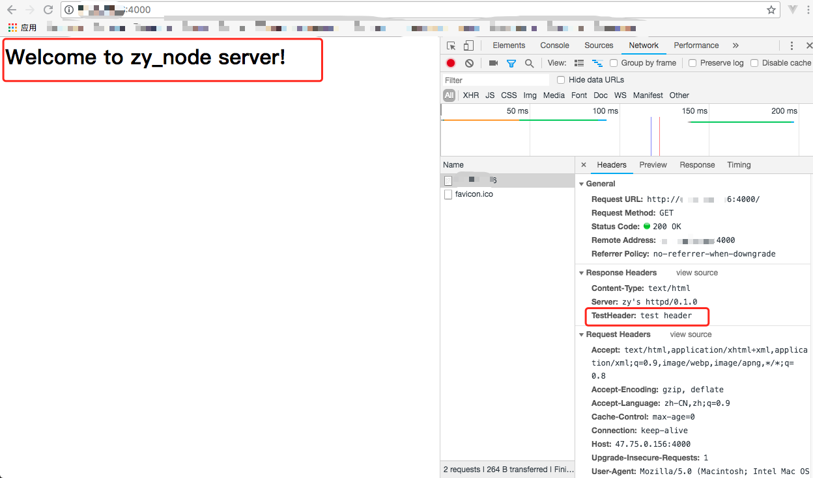

# 给自己的JS引擎插上HTTP的翅膀
这篇文章接着上篇文章《[利用v8引擎实现运行js文件](https://github.com/zy445566/myBlog/tree/master/20180708v8/20180714_run_js)》,根据上篇文章，相信同学们已经可以实现使用V8引擎运行JS文件，并有了不少的收获。这次我们直接给V8引擎插上Http的翅膀，让我们的V8引擎支持Http服务！<br />

    这次的Http服务实现，参考了J. David Blackstone在1999年写的tinyhttp,有兴趣用C裸写一个http协议的同学可以看一下，地址：https://sourceforge.net/projects/tinyhttpd/。

题外话，这可能会是我近期最后一次更贴，因为要 7，11，6 来赶公司的项目进度了。废话不多说，直接开干！友情提示：看这篇文章的话最好手动操作一次之前的文章，否则这篇文章对你帮助意义不会太大，大佬请忽略这句。<br />
    
    注意：本篇文章依旧基于上篇文章进行讲解

# 准备 && 配置
上篇文章，我们讲了如何配置gn和BUILD.gn和意义，这次不多说，这次我们要加两个配置在原配置上如下：
### 把文件先建好
```sh
touch /home/zy445566/v8/zy_node_src/http.h
touch /home/zy445566/v8/zy_node_src/http.cc 
```
### BUILD.gn
```py
v8_executable("zy_node") {
  sources = [
    "zy_node_src/zy_node.cc",
    # 增加引入之前写的http的头文件
    "zy_node_src/http.h",
    # 增加引入之前写的http的代码文件
    "zy_node_src/http.cc",
    "src/d8-console.cc",
    "src/d8-console.h",
  ]
  configs = [
    ":internal_config_base",
  ]

  deps = [
    ":v8",
    ":v8_libbase",
    ":v8_libplatform",
    "//build/win:default_exe_manifest",
  ]
}
```

# 代码编写和解析
涉及的三个源码文件的地址：[http.h](https://github.com/zy445566/myBlog/blob/master/20180708v8/20180714_run_js/http.h)，[http.cc](https://github.com/zy445566/myBlog/blob/master/20180708v8/20180714_run_js/http.cc)，[zy_node.cc](https://github.com/zy445566/myBlog/blob/master/20180708v8/20180714_run_js/zy_node.cc) 。

### 我们的目标
实现以下js调用http服务
```js
http(function(req,resp){
console.log("req:",JSON.stringify(req));

resp.headers.TestHeader = "test header";
resp.body = "<h1>Welcome to zy_node server!</h1>";

console.log("resp:",JSON.stringify(resp))

}).listen(4000);
```

### http.h
这里不多说，先把需要暴露的方法写好，实际只有Http需要暴露，其他只是为了不规定函数的顺序。直接上代码。
```h
// 主要是 u_short 定义需要socket.h，同时我们的http服务都是基于socket实现
#include <sys/socket.h>
// 引入v8::FunctionCallbackInfo<v8::Value>定义
#include <include/v8.h>

// 暴露Http服务给zy_node使用
void Http(const v8::FunctionCallbackInfo<v8::Value>& args);
```

### http.cc
这里主要讲围绕v8的http实现，tinyhttp部分请自行查看详解，边看代码边解析,这里抽关于v8实现http服务的方法进行解析。其实也不是很多，大约200行左右。
```cc
// 这里定义了全局的持久函数，持久性对象一般都是手动回收
// 为什么会用这个请往下看
v8::Persistent<v8::Function> g_cb;

// 这是用了把v8类型的字符串转成char类型的方法
const char* HttpToCString(const v8::String::Utf8Value& value) {
    return *value ? *value : "<string conversion failed>";
}

//这是封装的socket发送数据的方法，自动加\r\n，简单一看应该就清楚了
void sendWithRN(int client_num,const char* data)
{
    char cstr_rn[strlen(data)+2];
    strcpy(cstr_rn, data);
    strcat(cstr_rn,"\r\n");
    send(client_num, cstr_rn, strlen(cstr_rn), 0);
}

// 这是发送response头的方法
void respSetHeaders(
    int client_num,
    const v8::FunctionCallbackInfo<v8::Value>& args,
    v8::Local<v8::Object> resp_headers
)
{
    // 把response头的Object对象的键值取出，和Object.keys()类似，并返回数组
    v8::Local<v8::Array> resp_headers_keys= resp_headers->GetPropertyNames();
    // 把数组长度取出
    uint32_t len = resp_headers_keys->Length();
    // 遍历response头的Object对象，并用socket发送http数据
    for(uint32_t i = 0; i < len; i++){
        char buf[1024];
        v8::Local<v8::String> header = resp_headers_keys->Get(i)->ToString();
        v8::Local<v8::String> value = resp_headers->Get(header)->ToString();
        v8::String::Utf8Value header_utf(args.GetIsolate(), header);
        const char* header_cstr =  HttpToCString(header_utf);
        v8::String::Utf8Value value_utf(args.GetIsolate(), value);
        const char* value_cstr =  HttpToCString(value_utf);
        sprintf(buf, "%s: %s", header_cstr,value_cstr);
        sendWithRN(client_num,buf);
    }
}

// 这里的话主要是用于设置http的返回数据
void hellohttp(intptr_t client,
const v8::FunctionCallbackInfo<v8::Value>& args,
v8::Local<v8::Object> resp)
{
    // socket的句柄ID转换
    int client_num = (int)client;
    char buf[1024];
    // 设置发送http返回状态
    v8::Local<v8::String> status = resp->Get(v8::String::NewFromUtf8(args.GetIsolate(), "status", v8::NewStringType::kNormal)
            .ToLocalChecked())->ToString();
    v8::String::Utf8Value status_utf(args.GetIsolate(), status);
    const char* status_cstr =  HttpToCString(status_utf);
    sendWithRN(client_num, status_cstr);
    // 设置发送http的返回头信息
    v8::Local<v8::Object> resp_headers = resp->Get(v8::String::NewFromUtf8(args.GetIsolate(), "headers", v8::NewStringType::kNormal)
            .ToLocalChecked())->ToObject();
    respSetHeaders(client_num,args,resp_headers);
    // 设置发送结束头设置
    sprintf(buf, "\r\n");
    send(client_num, buf, strlen(buf), 0);
    // 设置发送http的返回html数据
    v8::Local<v8::String> body = resp->Get(v8::String::NewFromUtf8(args.GetIsolate(), "body", v8::NewStringType::kNormal)
            .ToLocalChecked())->ToString();
    v8::String::Utf8Value body_utf(args.GetIsolate(), body);
    const char* body_cstr =  HttpToCString(body_utf);
    sendWithRN(client_num, body_cstr);
}

// 用于接收http请求数据
void accept_request(void *arg,
const v8::FunctionCallbackInfo<v8::Value>& args,
v8::Local<v8::Object> req,
v8::Local<v8::Object> resp
)
{
    intptr_t client = (intptr_t)arg;
    char buf[1024];
    size_t numchars;
    char method[255];
    size_t i, j;
    // 接收第一行请求状态，包括协议之类的
    numchars = get_line(client, buf, sizeof(buf));
    req->Set(
        v8::String::NewFromUtf8(args.GetIsolate(), "status", v8::NewStringType::kNormal)
            .ToLocalChecked(),
        v8::String::NewFromUtf8(args.GetIsolate(), buf, v8::NewStringType::kNormal)
            .ToLocalChecked()
    );
    i = 0; j = 0;
    // 检查空白字符，获取使用方法
    //ISspace是ctype库用于检查是否有空白字符
    while (!ISspace(buf[i]) && (i < sizeof(method) - 1))
    {
        method[i] = buf[i];
        i++;
    }
    j=i;
    method[i] = '\0';
    // 接收请求头信息
    char* header_str;
    char header_name[1024];
    char header_value[1024];
    while ((numchars > 0) && strcmp("\n", buf)){
        // 接收一行请求头信息
        numchars = get_line(client, buf, sizeof(buf));
        // 把请求头封装成js的对象
        header_str=strtok(buf,": ");
        if (header_str != NULL) {
            // 切割请求头
            strcpy(header_name,header_str);
            header_str = strtok(NULL, ": ");
            if(header_str != NULL){
                strcpy(header_value,header_str);
                // 请求头键值封装成js的对象
                req->Set(
                    v8::String::NewFromUtf8(args.GetIsolate(), header_name, v8::NewStringType::kNormal)
                        .ToLocalChecked(),
                    v8::String::NewFromUtf8(args.GetIsolate(), header_value, v8::NewStringType::kNormal)
                        .ToLocalChecked()
                );
            }
            
        }
    }
    // 设置默认的返回头
    v8::Local<v8::Object> headers = v8::Object::New(args.GetIsolate());
    headers->Set(
        v8::String::NewFromUtf8(args.GetIsolate(), "Server", v8::NewStringType::kNormal)
            .ToLocalChecked(),
        v8::String::NewFromUtf8(args.GetIsolate(), "zy's httpd/0.1.0", v8::NewStringType::kNormal)
            .ToLocalChecked()
    );
    headers->Set(
        v8::String::NewFromUtf8(args.GetIsolate(), "Content-Type", v8::NewStringType::kNormal)
            .ToLocalChecked(),
        v8::String::NewFromUtf8(args.GetIsolate(), "text/html", v8::NewStringType::kNormal)
            .ToLocalChecked()
    );
    // 将返回头设置到resp的对象中
    resp->Set(
        v8::String::NewFromUtf8(args.GetIsolate(), "headers", v8::NewStringType::kNormal)
            .ToLocalChecked(),headers
    );
    // 设置默认的html数据
    const char default_body[1024]="<HTML><HEAD><TITLE>zynode_http</TITLE></HEAD><BODY><P>welcome to zynode http server.</P></BODY></HTML>";
    resp->Set(
        v8::String::NewFromUtf8(args.GetIsolate(), "body", v8::NewStringType::kNormal)
            .ToLocalChecked(),
        v8::String::NewFromUtf8(args.GetIsolate(), default_body, v8::NewStringType::kNormal)
            .ToLocalChecked()
    );
    // 设置默认的http状态数据
    resp->Set(
        v8::String::NewFromUtf8(args.GetIsolate(), "status", v8::NewStringType::kNormal)
            .ToLocalChecked(),
        v8::String::NewFromUtf8(args.GetIsolate(), "HTTP/1.0 200 OK", v8::NewStringType::kNormal)
            .ToLocalChecked()
    );
    // 准备JS回调方法
    const unsigned argc = 2;
    v8::Local<v8::Value> argv[argc] = { 
        req,
        resp
    };
    // 在这里now_cb就是根据v8的持久性数据转换而来的
    v8::Local<v8::Function> now_cb = v8::Local<v8::Function>::New(args.GetIsolate(),g_cb);
    // 进行JS回调
    now_cb->Call(args.GetIsolate()->GetCurrentContext()->Global(), argc, argv);
    // 使用socket发送http数据到客户端
    hellohttp(client,args,resp);
    //关闭这次链接
    close((int)client);
}

// 监听端口，相当于调用Js的http方法返回的listen方法
void ListenPort(const v8::FunctionCallbackInfo<v8::Value>& args) {
    // 参数检查
    if (args.Length() != 1) {
    args.GetIsolate()->ThrowException(
        v8::String::NewFromUtf8(args.GetIsolate(), "Bad parameters,only one parameter",
                                v8::NewStringType::kNormal).ToLocalChecked());
        return;
    }
    if(!args[0]->IsNumber())
    {
        args.GetIsolate()->ThrowException(
            v8::String::NewFromUtf8(args.GetIsolate(), "Parameter is not number",
                                    v8::NewStringType::kNormal).ToLocalChecked());
        return;
    }
    // 初始化socket数据，获取端口
    int server_sock = -1;
    u_short port = (u_short)args[0]->NumberValue();;
    int client_sock = -1;
    struct sockaddr_in client_name;
    socklen_t  client_name_len = sizeof(client_name);
    
    // 绑定端口开启socket服务
    server_sock = startup(&port);
    // 监听请求
    while(1){
        // 这个方法用于接收请求，收到请求后会继续执行
        client_sock = accept(server_sock,
                    (struct sockaddr *)&client_name,
                    &client_name_len);
        if (client_sock == -1)
                printf("accept");
        // 生成请求对象和返回数据对象
        v8::Local<v8::Object> req = v8::Object::New(args.GetIsolate());
        v8::Local<v8::Object> resp = v8::Object::New(args.GetIsolate());
        accept_request((void *)(intptr_t)client_sock,args,req,resp);
    }
}


void Http(const v8::FunctionCallbackInfo<v8::Value>& args) {
    // 参数检查
    if (args.Length() != 1) {
        args.GetIsolate()->ThrowException(
            v8::String::NewFromUtf8(args.GetIsolate(), "Bad parameters,only one parameter",
                                    v8::NewStringType::kNormal).ToLocalChecked());
        return;
    }
    if(!args[0]->IsFunction())
    {
        args.GetIsolate()->ThrowException(
            v8::String::NewFromUtf8(args.GetIsolate(), "Parameter is not function",
                                    v8::NewStringType::kNormal).ToLocalChecked());
        return;
    }
    // 将传入的方法持久化
    v8::Persistent<v8::Function> cb(args.GetIsolate(),args[0].As<v8::Function>());
    // 这个很精髓，因为V8的持久化对象不能copy，所以进行内存复制
    memcpy(&g_cb,&cb,sizeof(v8::Persistent<v8::Function>));
    // 原本是直接接收，没有使用持久化，结果方法结束就被回收了，这就是是使用持久化的原因
    //   cb = args[0].As<v8::Function>();
    // 生成对象，并把Listen包装进去
    v8::Local<v8::Object> http_object = v8::Object::New(args.GetIsolate());
    http_object->Set(
        v8::String::NewFromUtf8(args.GetIsolate(), "listen", v8::NewStringType::kNormal)
            .ToLocalChecked(),
        v8::FunctionTemplate::New(args.GetIsolate(), ListenPort)->GetFunction());
    // 返回之前生成的对象
    args.GetReturnValue().Set(http_object);
  }

```

# 编译
老规矩,和上篇一样不多说
```
ninja -C out.gn/x64.release
```

# 运行
直接上图：
 <br />
 <br />

# 总结
一开始有同学跟我反应说有点难，我说你实际操作过没有，他说没有。隔了几天，他说“他操作过一遍，收获很大，很感激”，所以有些话感觉还是要说一下。<br />
“苦难主义都是纸老虎”，所以如果真想动手深入并不是什么难事，我一开始也觉得实现http协议很难，但实现起来，http并没有我想象的难，甚至可以说是简单的。我这系列基于V8实现自己的JS引擎的文章都是尽可能简单，当然不排除看起来有些迷糊，但仔细看，实际操作一遍，其实不会太难。畏惧是魔鬼，勇敢迈出第一步吧！<br />


