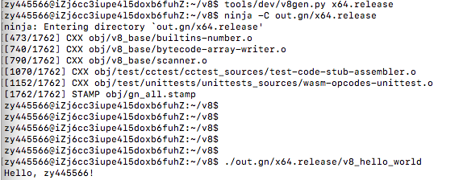

# V8的编译实战
感觉很少人把实战放出，都是理论为主，所以现在准备把一系列的V8实战教程放出。并附上使用V8构造自己的js运行时。但由于工作原因，将不定时更新（预计2到3周更新一次）。

# 准备
请先准备好命令行的翻墙，我是直接在某云购买的香港服务器用于该次实战。本次教程仅适用于mac和部分linux（本教程使用ubuntu 14.04，并建议使用,安装依赖省事）。同时使用adduser创建账号,同时加入sudoers，请勿使用root账号，gclient不支持root用户。同时安装git和依赖
```sh
sudo apt-get update
sudo apt-get install git -y
sudo apt-get install g++-4.8 -y
sudo apt-get remove libgnutls26 libgnutlsxx27 libgnutls-openssl27 -y # 如果没有则无需移除
sudo apt-get install libgnutls-dev -y
```
注意linux只支持以下版本，且不同版本要移除的依赖不一样：


# 下载谷歌源码管理器和v8源码 <br />
1. 首先使用git克隆depot_tools仓库,进入目录后，并将该目录加入到环境变量中。如我是直接在zy445566的用户目录目录操作的，目前我depot_tool目录就是/home/zy445566/depot_tools，所以我将/home/zy445566/depot_tools设置到我的全局目录中。<br />
```sh
git clone https://chromium.googlesource.com/chromium/tools/depot_tools.git
export PATH=$PATH:/home/zy445566/depot_tools # 建议把这个放入~/.bashrc，以便下次开机不会丢失
```
2. 接下来获取v8源码，并开始编译<br />
注意:获取v8的源码，请不要用git直接clone，由于仓库过大，很容易失败，使用depot_tools的fetch工具来拉取，才是官方推荐的做法。<br />
```sh
fetch v8 # 然后是漫长的等待
cd v8
gclient sync
sudo ./build/install-build-deps.sh # 这里如果依赖没有问题（主要是版本过高的问题），就能直接安装顺利。注意这里需要sudo，因为它本身会安装一些库,如果是mac和win请忽略该步骤
tools/dev/v8gen.py x64.release # 生成构建配置
ninja -C out.gn/x64.release # 正式构建,使用ninja来实现增量编译，即是你修改一部分代码，只会编译你修改的部分
```
注意
3. 验证是否编译成功，我改写了v8/sample的hello_world的例子，未修改则为“hello world！”。 <br />
运行结结果：<br />



