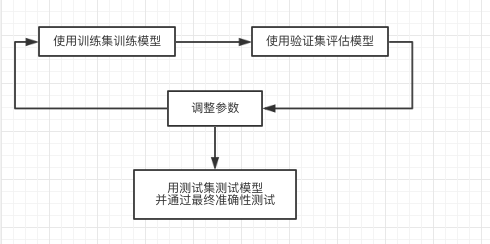

# 一个JS程序员对机器学习的学习总结 
为什么要学习机器学习，我认为有以下重要的三点：
* 可缩短我们的编程时间，比如可以通过机器学习学习垃圾话样本，进行更快速更精准的垃圾话的检测
* 普通编程方法难以解决的问题，比如用户潜在喜好和用户行为的预测
* 更重要的是扩宽我们程序员的思维逻辑，对于适用的方向能够提出这方面的构思

从前JS程序员要学习机器学习，总是困难的，很多时候被算法和复杂的逻辑所困住，但现在问题得到很大的缓解，我们可以用tensorflow.js（训练和部署机器语言模型的JavaScript库）提供的库和用更好的方式来更简单的实现机器学习能力。

本文将主要讲解机器学习的一些主要概念。更偏重适用tensorflow.js的实战的入门级教程，[请点击这里(前三节强烈推荐)](https://github.com/zy445566/tfjs-tutorials-zh/blob/master/README.md)。

# 基本的机器学习的流程一般是怎么样的
在学习机器学习前我认为首先要明确以下几点
* 标签 一般来说标签就是预测目标的结果，也可以是预测的正确值。
* 特征 一般是指提提供训练的样本，而样本分以下几类：
    * 有标签的样本（带正确答案的样本，大部分都是使用有标签的样本进行训练）
    * 无标签的样本（不带正常答案的样本）
* 模型 指的的是预测和训练样本的工具。你可以形象的理解为婴儿的大脑。
* 损失函数 用于计算标签和模型预测值的差值。
* 优化器 用于将损失函数计算的差值向正确方向优化的步伐
* 学习速度 一般代表优化器的优化的步伐大小，过大则容易偏离正确值，过小则要更多运算才能到达正确值。就好比你要到马路中间要走5米，然而一次走500米和一次走5厘米，都很难到达马路中间。

好了，知道了以上几种概念，那么我们来以一张图的方式来展示，机器到底是如何进行学习的。

那么从图中很容易了解到，我们是将特征输入到模型中计算出预测值，将标签进行通过损失函数计算出误差值，再交给优化器优化，参数更新后，模型再重复这一个过程，就构成了基本的机器学习的流程。

# 过拟合
为什么要讲过拟合？什么是过拟合？

防止过拟合是分类器的一个核心任务。而比如人脸识别，实际上就是一个分类器，比如将图片的风景，动物脸，人脸中的人脸的特征进行归类，将欧美人脸，亚太人脸，非洲人脸进行归类，甚至可以将某个特定的人的脸单独归为一类。所以它在机器学习里面也有举足轻重的地位。

那什么是过拟合呢？举个例子，我们在日常生活中见到的羊都是白色的，那有一天看到了除了颜色是黑色其他特征和我们日常见到的白羊都是一样的，那我们是不是就会认为这不是一只羊，人当然不会因为颜色就断定这不是一只羊，而机器却会说我见过的羊都是白色的，所以不可能有黑色的羊，所以这不是一只羊。过拟合官方的解释是为了得到一致假设而使假设变得过度严格。

那么过拟合要如何解决呢？这是一个机器学习重要的能力：泛化。

那么如何保证泛化，经验告诉我们有3个要点：
* 从分布中抽取`独立同分布`(iid)样本
* 分布是`平稳的`不会随时间变化而变化
* 始终从`同一分布`抽取样本

但样本的使用也同样重要，一般我们会将样本分为 训练集，验证集，测试集。

各自用途是什么？为什么需要分3个集？

用途是什么，这个问题很简单：
* 训练集 用于训练模型
* 验证集 用于评估模型，即在训练每轮后验证训练的准确性，并帮助矫正参数
* 测试集 用于测试模型，验证模型的准确性

为什么需要分3个集？可能大家会觉得为什么要三个集，直接用测试集评估和测试模型不就好了。

那我们做一个假设。如果我们用测试集评估模型，然后调整参数的话如下图：

那么会不会出现之前所说`过拟合`的问题呢？答案是会的。即为了得到一致假设而使假设变得过度严格，请仔细思考这句话。

而正确的方式应该是：

使用这样的流程就不会产生因为测试数据加入训练，导致通过了最终的测试数据中。

# 处理源数据的技巧
在训练模型之前我们需要处理大量的源数据同时转换为我们模型可以使用的数据，那么源数据的处理技巧就至关重要了。

在将原始数据处理成特征的这个过程，我们叫特征工程。

那么我们在做特征工程时有什么技巧：
* 字符串可以使用独热编码
* 过滤非合理数据，比如库中极少的数据
* 筛选不随时间变化的特征
* 使用分箱技巧处理非线性性特征

当然我们在处理这类数据时，也应保持以下几点以更容易暴露有问题的数据：
* 将数据可视化呈现
* 不断地对数据进行调试
* 对数据进行监控

讲了数据处理，我们讲讲扩展数据集的方法，那么什么是扩展数据集呢？比如我们的数据集不是很充足，比如只有10个，显然是不足以训练模型的数据集，目前最主流的方法是可以通过它的单一特征来实现扩展，比如都在某个城市出现过，这种是线性的扩展方式。但是
而对数据的处理中很多特征，不是通过简单的单一线性就能划分的特征，比如在某个城市出现过的且短期存在的特征，这个就是非线性特征，我们需要短期存在和某个城市出现两个特征一起查询数据，这样的过程叫做特征交叉，即将两个数据交叉后转换为线性的方法。目前的事实也证明通过通过线性扩展数据是最高效的方法。（个人觉得说特征交叉就高大上一点，而两个条件相交查询就不专业了）

# 如何降低更多的损失
在之前说过我们的模型训练需要通过损失函数计算损失，那么我们如何降低更多的损失呢？就比如我们训练集的损失度通过不断的学习越来越低，而测试集在训练集损失最低的时刻并不能是最低点，甚至说训练集样本损失度更高的时候，测试集损失度反而更低，我们应该如何解决这个问题。让机器学习更好泛化到新样本中呢？

解决方案：
* 使用测试集测试的损失度最低点时的模型
* 正则化

第一种方案在实际的操作中比较难控制，那么我们今天主要来讲讲主要使用的L2（岭回归）正则化，即以下几点。
* 定义复杂度（模型）= 权重的平方和
* 使用适当的权重
* 对于线性模型：首选比较平缓的斜率
* 贝叶斯先验概率：
    * 权重应该以 0 为中心
    * 权重应该呈正态分布

同时我们也可以增加lambda来增强正则化效果。

# 未完成