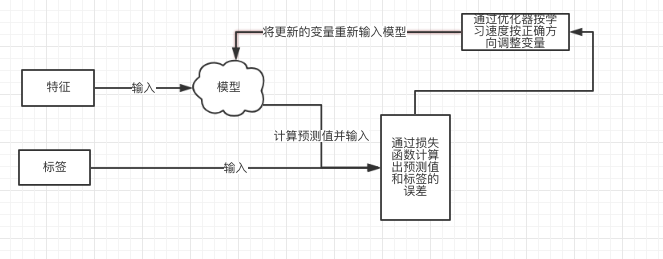

# 一个JS程序员对机器学习的学习总结 
为什么要学习机器学习，我认为有以下重要的三点：
* 可缩短我们的编程时间，比如可以通过机器学习学习垃圾话样本，进行更快速更精准的垃圾话的检测
* 普通编程方法难以解决的问题，比如用户潜在喜好和用户行为的预测
* 更重要的是扩宽我们程序员的思维逻辑，对于适用的方向能够提出这方面的构思

从前JS程序员要学习机器学习，总是困难的，很多时候被算法和复杂的逻辑所困住，但现在问题得到很大的缓解，我们可以用tensorflow.js（训练和部署机器语言模型的JavaScript库）提供的库和用更好的方式来更简单的实现机器学习能力。

本文将主要讲解机器学习的一些主要概念。更偏重适用tensorflow.js的实战的入门级教程，[请点击这里(前三节强烈推荐)](https://github.com/zy445566/tfjs-tutorials-zh/blob/master/README.md)。

# 基本的机器学习的流程一般是怎么样的
在学习机器学习前我认为首先要明确以下几点
* 标签 一般来说标签就是预测目标的结果，也可以是预测的正确值。
* 特征 一般是指提提供训练的样本，而样本分以下几类：
    * 有标签的样本（带正确答案的样本，大部分都是使用有标签的样本进行训练）
    * 无标签的样本（不带正常答案的样本）
* 模型 指的的是预测和训练样本的工具。你可以形象的理解为婴儿的大脑。
* 损失函数 用于计算标签和模型预测值的差值。
* 优化器 用于将损失函数计算的差值向正确方向优化的步伐
* 学习速度 一般代表优化器的优化的步伐大小，过大则容易偏离正确值，过小则要更多运算才能到达正确值。就好比你要到马路中间要走5米，然而一次走500米和一次走5厘米，都很难到达马路中间。

好了，知道了以上几种概念，那么我们来以一张图的方式来展示，机器到底是如何进行学习的。

那么从图中很容易了解到，我们是将特征输入到模型中计算出预测值，将标签进行通过损失函数计算出误差值，再交给优化器优化，参数更新后，模型再重复这一个过程，就构成了基本的机器学习的流程。

# 过拟合
为什么要讲过拟合？什么是过拟合？

防止过拟合是分类器的一个核心任务。而比如人脸识别，实际上就是一个分类器，比如将图片的风景，动物脸，人脸中的人脸的特征进行归类，将欧美人脸，亚太人脸，非洲人脸进行归类，甚至可以将某个特定的人的脸单独归为一类。所以它在机器学习里面也有举足轻重的地位。

那什么是过拟合呢？举个例子，我们在日常生活中见到的羊都是白色的，那有一天看到了除了颜色是黑色其他特征和我们日常见到的白羊都是一样的，那我们是不是就会认为这不是一只羊，人当然不会因为颜色就断定这不是一只羊，而机器却会说我见过的羊都是白色的，所以不可能有黑色的羊，所以这不是一只羊。过拟合官方的解释是为了得到一致假设而使假设变得过度严格。

那么过拟合要如何解决呢？这是一个机器学习重要的能力：泛化。

那么泛化要如何实现呢？

