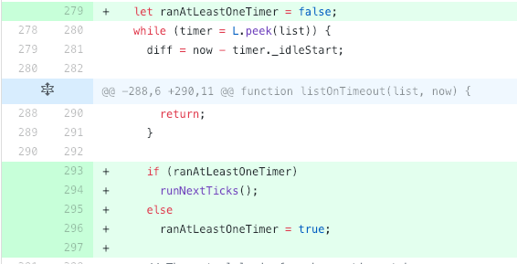

# 又被node的eventloop坑了，这次被啪啪打脸
近日在论坛上看到一篇文章讲node和谷歌浏览器的eventloop的区别，因为看到写的还不错，我表示了肯定。但没过多久一位坛友却说node11结果不一样，我说怎么可能不一样。接着坛友贴了个代码，我试着运行了一下，啪啪！

# 一探究竟
先上被啪啪打脸的代码：
```js
setTimeout(() => {
  console.log('timer1');
  Promise.resolve().then(function() {
    console.log('promise1');
  });
}, 0);
setTimeout(() => {
  console.log('timer2');
  Promise.resolve().then(function() {
    console.log('promise2');
  });
}, 0);
```

了解node的eventloop的同学应该知道
1. 这个就是一开始将两个setTimeout放进timers的阶段
2. 然后在运行timer1，把promise1的Promise放入timers的下一阶段microtask队列中，同理继续运行timers的阶段，执行timer2，把promise2的Promise放入timers的下一阶段microtask队列中。
3. 直到timers队列空，才开始运行microtask队列，也就是promise1和promise2.
那么就是以下结果：
```js
timer1
timer2
promise1
promise2
```
node10运行结果是没问题的，但node11运行后居然是：
```js
timer1
promise1
timer2
promise2
```
先是吃惊，然后镇定，仔细去翻node的修改日志，在node 11.0 的修改日志里面发现了这个：
* Timers
    * Interval timers will be rescheduled even if previous interval threw an error. #20002
    * nextTick queue will be run after each immediate and timer. #22842

然后分别看了20002和22842的PR，发现在 [https://github.com/nodejs/node/pull/22842](https://github.com/nodejs/node/pull/22842) 在lib/timers.js里面有以下增加：




这两个是什么意思呢？提示一下runNextTicks()就是process._tickCallback()。用过的可能知道这个就是除了处理一些异步钩子，就是用于执行微任务队列的。

# 那么为什么要这么做呢？
当然是为了和浏览器更加趋同。
了解浏览器的eventloop可能就知道，浏览器的宏任务队列执行了一个，就会执行微任务。

简单的说，可以把浏览器的宏任务和node10的timers比较，就是node10只有全部执行了timers阶段队列的全部任务才执行微任务队列，而浏览器只要执行了一个宏任务就会执行微任务队列。

现在node11在timer阶段的setTimeout,setInterval...和在check阶段的immediate都进行了一旦执行一个阶段里的一个任务就立刻执行微任务队列。

当然代码稍作修改，在node10也能和node11一样。
```js
setTimeout(() => {
    console.log('timer1');
    Promise.resolve().then(function() {
        console.log('promise1');
    });
    process._tickCallback();
}, 0);
setTimeout(() => {
    console.log('timer2');
    Promise.resolve().then(function() {
        console.log('promise2');
    });
    process._tickCallback();
}, 0);

```

# 最后
没时间了，写下班了。。。