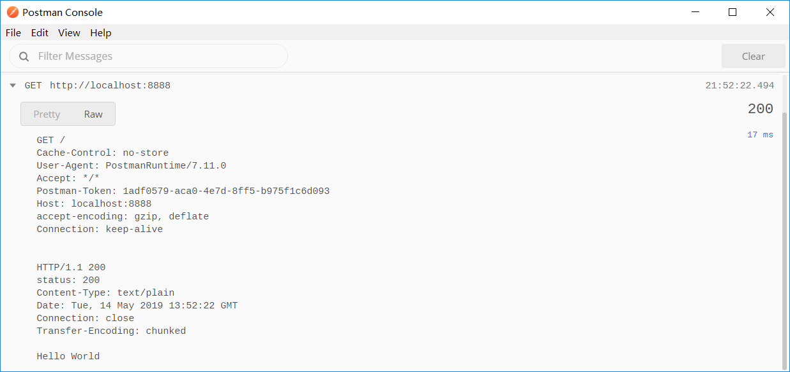

# 为什么在HTTP的chunked模式下不需要设置长度
昨天看到论坛上有位同学提问，为什么Transfer-Encoding为chunked的时候不需要设置content-length，为什么非要设置content-length呢？这位同学认为HTTP中内容长度是可有可无没必要设置的。真的是这样吗？chunked模式下真的就没有设置长度吗？

# 起因
一位同学看到《Http权威指南》p131下面写到，响应实体应该有content-type,content-length。但是这位同学在学习node时，发现他写的服务器并没有满足这两个条件。

他通过菜鸟教程的例子:
```js
var http = require('http');

http.createServer(function (request, response) {

    // 发送 HTTP 头部 
    // HTTP 状态值: 200 : OK
    // 内容类型: text/plain
    response.writeHead(200, {'Content-Type': 'text/plain'});

    // 发送响应数据 "Hello World"
    response.end('Hello World\n');
}).listen(8888);

// 终端打印如下信息
console.log('Server running at http://127.0.0.1:8888/');
```
发现PostMan中并没有发现content-type和content-length，即认为服务器并没有给出内容长度，如下：



这个问题是思考过后的结果，我认为这个问题提非常棒，我非常期待更多像这样富有思考的问题。同时感谢这位同学的提问和素材。

# 但真的chunked没有给出长度吗？
当然不是，chunked给出的长度是在内容的报文当中的，我们可以用socket简单实现一下http1.1的chunked。

实现如下：
```js
// 直接使用socket简单实现http1.1协议chunked部分
const net = require('net');
const port = 3000;
net.createServer((socket) => {
    socket.on('data',(data)=>{
        let msg = data.toString();
        console.log(msg) //读取的客户端请求数据
        socket.write('HTTP/1.1 200 OK\r\n');
        socket.write(`Date: ${new Date().toGMTString()}T\r\n`);
        socket.write('Content-Type: text/html\r\n');
        socket.write(`Transfer-Encoding: chunked\r\n`);
        // 这里是16进制数字，表示后面有12字节数据
        socket.write(`\r\n${(12).toString(16)}\r\n`);
        socket.write('Hello World!');
        socket.write(`\r\n0\r\n\r\n`); // say Bye-Bye
    });
}).listen(port);
console.log(`use: curl -v http://127.0.0.1:${port}`)
```
在这里面你可以看到，这里就是声明了chunk的字节长度
```js
 socket.write(`\r\n${(12).toString(16)}\r\n`);
 ```
 同时最后say Bye-Bye的时候，声明了后续的长度为0，最后已回车确认结束
 
 那么content-length和chunked有什么区别呢？
 即是声明了content-length需要将内容报文一次给出，而chunked不用。
 
 比如我修改一下代码：
 ```js
// 直接使用socket简单实现http1.1协议chunked部分
const net = require('net');
const port = 3000;
net.createServer((socket) => {
    socket.on('data',(data)=>{
        let msg = data.toString();
        console.log(msg) //读取的客户端请求数据
        socket.write('HTTP/1.1 200 OK\r\n');
        socket.write(`Date: ${new Date().toGMTString()}T\r\n`);
        socket.write('Content-Type: text/html\r\n');
        socket.write(`Transfer-Encoding: chunked\r\n`);
        // 这里是16进制数字，表示后面有12字节数据
        socket.write(`\r\n${(12).toString(16)}\r\n`);
        socket.write('Hello World!');
        // ### 注意这是新增的部分 ###
        socket.write(`\r\n${(4).toString(16)}\r\n`);
        // ### 注意这是新增的部分 ###
        socket.write('Boy!');
        socket.write(`\r\n0\r\n\r\n`); // say Bye-Bye
    });

}).listen(port);
console.log(`use: curl -v http://127.0.0.1:${port}`)
 ```
 注意我新增的部分。chunked可以利用不断的追加内容在尾部增加报文的长度，实现段传输，最后完成后合成一个完整的http。但content-length在开始就定义好了长度，所以content-length不能像chunked一样，一直在尾部增加长度和内容。

# 结论
chunked还是给浏览器传输了长度，但是偷偷藏在了报文当中，所以并没有显式地像content-length在头部声明。当然也不能说《Http权威指南》是错误的，也许这本书有一定的年纪了呢？毕竟chunked是http1.1才有的，http1.0还不存在。